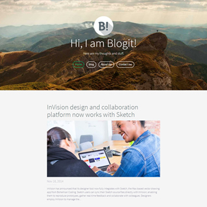

# subrion-template-blogit
Template for bloggers

## Preview


## Installation
1. Download latest release https://github.com/intelliants/subrion-template-blogit/releases
2. Unpack contents of archive to `[root]/templates` folder
3. Rename `subrion-template-blogit-master` to `blogit`
4. Activate template in admin dashboard.

Or you can
```
cd [root]/templates # where root is the location of subrion core
git clone https://github.com/intelliants/subrion-template-blogit.git ./blogit
```
Voila! Just activate it in your Dashboard / Extensions / Templates

## Development

> This manual covers development of visual styles. To learn more about Subrion template structure and configuration options, please refer to Subrion Extensions wiki page: `URL_TO_SUBRION_WIKI`

The Blogit template is setup to use [Gulp](http://gulpjs.com/) to compile LESS (with source maps), run it through [AutoPrefixr](https://github.com/postcss/autoprefixer), optimize images, and syncs changes across local development devices with [BrowserSync](https://browsersync.io/docs/gulp/), with flexibility to add any additional tasks via the Gulpfile. Alternatively, you can use [Prepros](https://prepros.io/) or whatever else y ou prefer to compile the LESS and manage the JavaScript.

### Prerequisites

In root folder of Blogit template run:
```
npm i
```
To install all necessary node modules.

#### BrowserSync
Before running `dev` task, be sure to copy **config.sample.json** and rename it to **config.json**. Then change server config in **config.json** file for BrowserSync to work properly. Otherwise BrowserSync won't work.

### Tasks

```
gulp dev
```
Starts BrowserSync and watches for LESS files. Optimizes images and compiles LESS with SourceMaps.

```
gulp build
```
Compiles LESS and optimizes images.

### Compiling with GUI tools

If you don't want to use Gulp task-runner to process template files, you can use any GUI compilers like [Prepros](https://prepros.io/), [Koala](http://koala-app.com/) or [Simpless](https://wearekiss.com/simpless).

What is important:
* The main file for compilation is `iabootstrap.less`. It should be compiled to `[root]/templates/blogit/css/iabootstrap.css`

### Template styles/elements page

There is a hidden page with all supported elements. You can access it like this:
```
http://yourdomain.com/?elements
```

## Contributing

Anyone is welcome to contribute! Check out the [Contributing Guidelines](CONTRIBUTING.md).